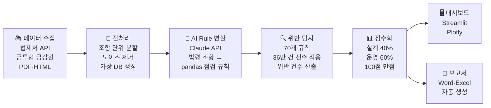

# AI 기반 금융권 IT감사 사전 통제 점검 및 보고서 자동 생성 시스템

[](https://it-audit.streamlit.app/)


> **서강대학교 대학원 | 생성형 AI 활용 과목 프로젝트**  
> 법령 기반 IT통제 점검 규칙을 자동 생성하고, 36만 건 로그를 전수 분석해 위반을 탐지·시각화·보고서로 출력하는 시스템

---

## 문제 정의 (Problem)

금융권 IT감사 현장에서 반복되는 3가지 구조적 문제를 해결하고자 합니다.

| # | 문제 | 설명 |
|---|------|------|
| 01 | **사전 점검 체계 부재** | 전문 지식과 자체 점검 시스템이 없어 감사를 받아야만 문제를 인지 |
| 02 | **소통의 어려움** | 감사인·개발자 간 공통 언어 부재 → 추상적 질의와 반복적 소명 발생 |
| 03 | **취약 패턴 미파악** | 위반 원인에 대한 정량적 분석 불가, 일회성 대응에 그침 |

---

## 솔루션 (Solution)

```
법령 텍스트 → AI Rule 자동 생성 → 전수 탐지 → 점수화 → 대시보드 + 보고서 자동 출력
```

| # | 솔루션 | 효과 |
|---|--------|------|
| 01 | **Rule 엔진 기반 사전 통제 점검 자동화** | 법적 리스크 사전 차단, 감사 준비 시간 단축 |
| 02 | **통제 기준의 데이터화 + 근거 제시** | 정확한 수치로 객관적 증명, 감사인·개발자 공통 언어 제공 |
| 03 | **설계·운영 이중 평가 + AI 취약 패턴 분석** | 근본 원인 파악 후 구조적 개선 가이드 제공 |

---

## 왜 AI인가? (AI 차별성)

단순 규칙 기반 점검 도구와의 결정적 차이는 **"법령 텍스트 → 실행 가능한 점검 규칙" 자동 변환**입니다.

| 구분 | 기존 방식 | AI 도입 후 |
|------|-----------|------------|
| 규칙 생성 | 감사인이 법령을 읽고 수작업으로 점검 항목 작성 | Claude API가 약 1,900개 법령 조항을 분석해 pandas 실행 코드 포함 규칙 자동 생성 |
| 위반 해석 | 로그 수치만 보고 감사인이 직접 판단 | AI가 위반 원인·우선 조치·종합 총평을 자연어로 자동 생성 (Streaming) |
| 제재 연결 | 위반 항목과 제재 사례 수동 매핑 | 금감원 203건 IT 제재공시와 자동 매핑, 유사 사례 즉시 경고 |
| 보고서 | 엑셀·워드 수작업 작성 | 점검 결과 기반 Word·Excel 감사보고서 원클릭 자동 생성 |

> **핵심**: 법령 조문이라는 비정형 자연어를 실행 가능한 파이썬 코드(pandas_logic)로 변환하는 것은 기존 규칙 기반 시스템이 수행할 수 없는 작업입니다.

---

## 시스템 파이프라인



---

## 탐지 성능 지표 (Metrics)

### 점검 규모

| 지표 | 수치 |
|------|------|
| 점검 규칙 수 | **70개** (접근통제 42 / 변경관리 15 / 운영통제 13) |
| 법령 출처 | 전자금융감독규정, 개인정보보호법, 정보보호관리체계 기준 등 7개 법령 |
| 적용 로그 | **약 36만 건** (6개월 접근 로그 기준) |
| 위반 탐지 규칙 | **43개** (전체 대비 **61.4%** 위반율) |

### 위험도 점수 체계

```
종합 점수 = 설계 점수(40%) × 규칙 준수율 + 운영 점수(60%) × 로그 준수율
```

| 구간 | 등급 | 설명 |
|------|------|------|
| 80점 이상 | 🟢 정상 | 통제 체계 양호 |
| 60 ~ 79점 | 🟡 주의 | 개선 권고 |
| 60점 미만 | 🔴 고위험 | 즉각 조치 필요 |

### 규칙별 위험도 분류 기준

규칙별 위험 점수 = `심각도(HIGH=3 / MEDIUM=2 / LOW=1)` × `log₁₊(위반 건수)`

| 등급 | 임계값 |
|------|--------|
| Critical | 8점 이상 |
| High | 5점 이상 |
| Medium | 2점 이상 |
| Low | 2점 미만 |

---

## 주요 기능 (대시보드 8개 뷰)

| 메뉴 | 내용 |
|------|------|
| 종합 현황 | 도메인별 종합 점수, 월별 위반 추이, 핵심 위험 지표 |
| 규칙별 점검 결과 | 70개 규칙 전체 위반 여부·건수·심각도 |
| 심화 분석 | 부서별·역할별 위험도, 규칙별 위험도 분포, 법령 준수율, 복합 위험 사용자 |
| AI 인사이트 | 위반 해석·우선 조치·종합 총평 (Claude API Streaming) |
| 제재 사례 | 금감원 IT 제재공시 203건 매칭 및 경고 |
| 비교 분석 | 전월 대비 위반 변동 추이 |
| 월별 트렌드 | 7개월(2025.11~2026.05) 위반 패턴 변화 |
| 보고서 생성 | Word·Excel 감사보고서 원클릭 다운로드 |

---

## 실제 도입 시나리오

현재는 가상 DB 환경에서 구현되었으나, 실제 금융 IT 시스템과 다음과 같이 연계할 수 있습니다.

```
┌─────────────────────────────────────────────────────┐
│              실제 금융사 IT 환경                     │
│                                                     │
│  [HR 시스템] ──┐                                    │
│  [IAM/SSO]  ──┼──→ [데이터 수집 레이어]            │
│  [SIEM 로그] ──┤     (API 연동 or DB Direct)        │
│  [ITSM]     ──┘          │                         │
│                           ▼                         │
│               [Rule 엔진 + AI 분석]                 │
│                 (이 시스템 코어)                    │
│                           │                         │
│                           ▼                         │
│     [감사 대시보드] ── [자동 보고서] ── [알람]      │
└─────────────────────────────────────────────────────┘
```

**연계 포인트:**
- **HR·IAM**: 직원 재직 정보·계정 권한 API 연동으로 퇴직자 활성 계정 실시간 탐지
- **SIEM**: 접근 로그 스트리밍 연동으로 실시간 이상 징후 탐지 가능
- **ITSM**: 변경요청서 자동 연동으로 사후승인·직무분리 위반 즉시 탐지

---

## 수집 데이터

| 출처 | 내용 | 수량 |
|------|------|------|
| 법제처 Open API | 전자금융감독규정 등 7개 법령 | 약 800개 조문 |
| 금융투자협회 | IT감사 가이드라인 | 42개 항목 |
| 금융감독원 | 전자금융감독규정 해설서(2025.8) | 284개 항목 |
| 금융감독원 | IT관련 제재공시 | 203건 |
| **합계** | | **약 1,900개 조항** |

---

## 가상 DB 구성

금융권 중견사(직원 500명) 규모로 생성. 의도적 위반 패턴 삽입으로 탐지 시나리오 구현.

| 테이블 | 설명 | 행 수 |
|--------|------|-------|
| emp_master | 직원 마스터 (재직·퇴직) | 500행 |
| sys_account | 시스템 계정 (권한·상태) | 1,195행 |
| access_log | 시스템 접근 로그 (6개월) | 322,445행 |
| itsm_req | IT 변경요청서 | 184행 |
| deploy_log | 배포 이력 | 184행 |
| backup_log | 백업 이력 | 905행 |

---

## 기술 스택

| 분류 | 기술 |
|------|------|
| Language | Python 3.11+ |
| Frontend | Streamlit, Plotly |
| AI | Anthropic Claude API (claude-opus-4-5) |
| Data | Pandas, NumPy |
| Crawling | requests, BeautifulSoup4, pdfplumber |
| Report | python-docx, openpyxl |
| Data Gen | Faker |
| Deploy | Streamlit Cloud |

---

## 프로젝트 구조

```
it_audit_project/
├── app.py                          # Streamlit 대시보드 메인 (8개 뷰)
├── main.py                         # 전체 파이프라인 실행 진입점
├── src/
│   ├── crawlers/
│   │   ├── law_api.py              # 법제처 API 법령 수집
│   │   ├── kofia_crawler.py        # 금투협 IT감사 가이드라인 수집
│   │   ├── fss_guide_parser.py     # 금감원 전자금융감독규정 해설서 파싱
│   │   └── fss_sanction_crawler.py # 금감원 IT 제재공시 수집
│   ├── generate_virtual_db.py      # 가상 DB 생성 (500명 규모 금융사)
│   ├── preprocess.py               # 파생 컬럼 생성 (위반 판정 플래그)
│   ├── rule_converter.py           # 법령 조항 → Rule JSON 변환 (Claude API)
│   ├── rule_engine.py              # Rule 엔진 (70개 규칙 전수 적용)
│   └── report_generator.py         # Word·Excel 보고서 자동 생성
├── data/
│   ├── raw/                        # 수집 원본 (법령·가이드라인·제재공시)
│   └── processed/                  # 전처리 결과 (rules.json, violations_summary.csv 등)
├── notebooks/
│   └── analysis.ipynb              # 탐색적 데이터 분석
├── .env.example                    # 환경변수 설정 예시
└── requirements.txt                # 의존성 패키지
```

---

## 실행 방법

### 환경 설정

```bash
git clone https://github.com/westyeon/it_audit_project.git
cd it_audit_project
pip install -r requirements.txt
cp .env.example .env
# .env에 ANTHROPIC_API_KEY 입력
```

### 대시보드 바로 실행 (분석 결과 포함)

```bash
streamlit run app.py
```

### 전체 파이프라인 순서 실행

```bash
# 1. 법령·가이드라인 수집
python src/crawlers/law_api.py
python src/crawlers/kofia_crawler.py
python src/crawlers/fss_guide_parser.py
python src/crawlers/fss_sanction_crawler.py

# 2. 가상 DB 생성 및 전처리
python src/generate_virtual_db.py
python src/preprocess.py

# 3. Rule JSON 변환 (Claude API 호출)
python src/rule_converter.py

# 4. Rule 엔진 실행 (위반 탐지)
python src/rule_engine.py

# 5. 대시보드 실행
streamlit run app.py
```

### 배포 버전 바로 보기

**[https://it-audit.streamlit.app/](https://it-audit.streamlit.app/)**

---

## 한계 및 향후 개선 방향

- 현재 가상 DB 기반 → 실제 HR·IAM·SIEM 시스템 API 연동으로 확장 가능
- 탐지 규칙 70개 → 법령 업데이트 시 자동 재생성 파이프라인 구축 예정
- AI 인사이트 정확도 검증 지표(Precision/Recall) 수집 체계 추가 필요
